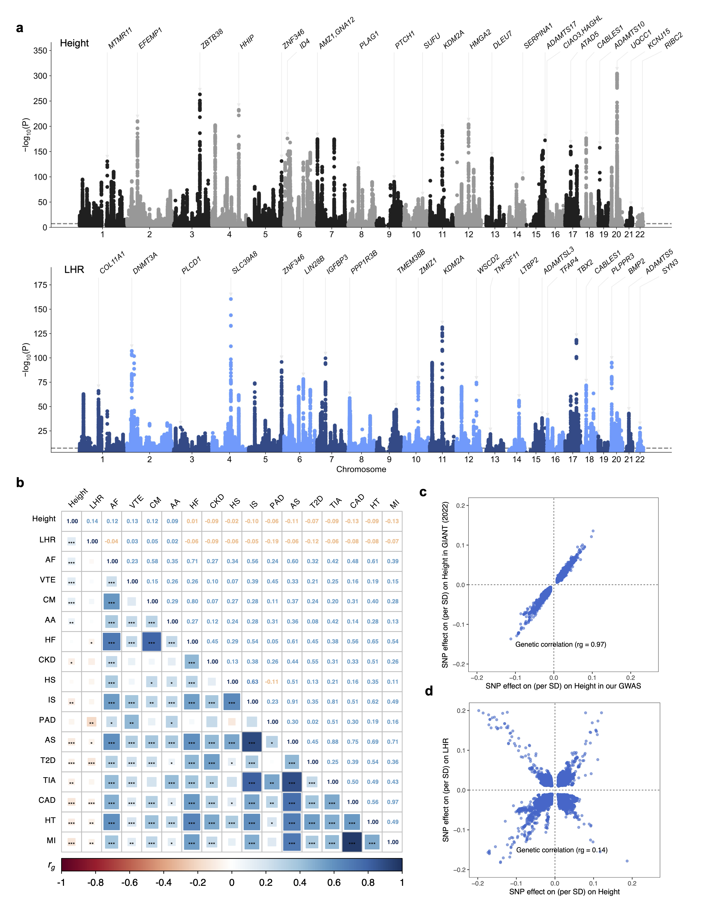

# LHR

## **Independent association of leg-height ratio with 15 cardiometabolic diseases**

GWAS summary statistics of height and LHR: https://zenodo.org/records/15861435

### *Abstract*

Background: The causal association between adult height and coronary artery disease (CAD) was established a decade ago. Accumulating evidence has since linked adult height to a variety of cardiometabolic diseases (CMD). As waist-hip ratio has become an increasingly important independent risk factor in addition to body mass index, we aim to assess whether leg-height ratio (LHR) could also be a risk factor independent of overall height.
Methods: LHR was defined as the ratio of leg length to standing height and further adjusted it for overall height by regression. Using data from UK Biobank, we first performed genome-wide association study (GWAS) of LHR and height, then assessed associations of them with 15 major CMD at phenotypic and genetic level. Mediation and colocalization analyses were conducted to identify mediators and shared variants.
Results: We identified 740 genome-wide significant loci of LHR after conditional analyses. SNP-based heritability was estimated at 24% for LHR, versus 46% for height. A low LHR (bottom 20%) was associated with a substantially higher risk of CAD than a medium (middle 60%) or high (top 20%) LHR, regardless of the height category. This pattern is more pronounced for type 2 diabetes (T2D), where tall individuals with low LHR exhibit higher risk (HR = 1.39 [1.29-1.49], P = 2.7×10-20) than individuals of short or medium height with higher LHR. Lipids (especially high-density lipoprotein cholesterol) primarily mediates the protective effect of LHR on CMD, whereas inflammatory markers (especially neutrophils) mainly mediate that of height. Mendelian randomization analyses using 674 SNPs support the protective effects of LHR. Colocalization analyses revealed LHR-specific variants shared with CMD, including notable colocalization with T2D at the JAZF1 locus.
Conclusions: LHR has independent and differential effects on a suite of CMD traits. Lipids mainly mediate the protective association between LHR and CMD.

### *Fig. 1*
GWAS of height and LHR; Genetic correlation of height and LHR with 15 CMD

### *Fig. 2*
Phenotypic and genetic associations of height and LHR with 15 CMD

### *Fig. 3* 
Joint associations of height and LHR with

### *Fig. 4* 
Mediation analysis
